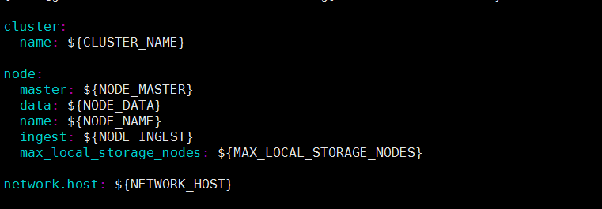
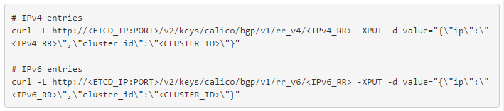

* [1、日志平台运维文档](#1)
* [2、监控平台运维文档](#2)
* [3、lvs运维文档](#3)
* [4、docker运维文档](#4)
* [5、kubelet运维文档](#5)
* [6、apiserver运维文档](#6)
* [7、controller-manager运维文档](#7)
* [8、kube-scheduler运维文档](#8)
* [9、kube-proxy运维文档](#9)
* [10、calico 运维文档](#10)
* [11、harbor运维文档](#11)
* [12、自定义扩容运维文档](#12)
* [13、宿主机权限运维文档](#13)
* [14、etcd运维文档](#14)
* [15、monit运维文档](#15)
* [16、toa运维文档](#16)
* [17、证书运维文档](#17)
* [18、新idc初始化安装组件确认](#18)

# 容器平台（南沙环境）机器类型
>### 现有容器网段
>10.3.240.0/24~10.3.247.0/24、10.3.216.0/24~10.3.223.0/24 
>### lvs
>内网（10.3.214.10\10.3.214.130） 
>外网（10.3.213.10\10.3.213.130\10.3.213.70\10.3.213.180\10.3.215.10\10.3.215.50\10.3.215.130\10.3.215.180） 
>### etcd
>(10.3.252.3\10.3.252.6\10.3.252.7) 
>### master
>(10.3.252.4\10.3.252.5\10.3.252.19) 
>### elasticsearch
>集群1： 
>client:(10.3.252.28/10.3.252.29/10.3.252.30) 
>master:(10.3.252.28/10.3.252.29/10.3.252.30) 
>data:(10.3.252.20/10.3.252.21/10.3.252.22/10.3.252.93/10.3.252.101/10.3.252.102/10.3.252.103/10.3.252.104/10.3.252.105/10.3.252.105) 
>集群2: 
>client:(10.3.252.25) 
>master:(10.3.252.48/10.3.252.49/10.3.252.50) 
>data:(10.3.252.107/10.3.252.108/10.3.252.109/10.3.252.114/10.3.252.115) 
>### prometheus
>write: 
>（10.3.252.72/10.3.252.2） 
>read: 
>（10.3.252.2） 
>influxdb: 
>(10.3.252.38/10.3.252.39/10.3.252.40) 
>### 生产环境harbor(暂未迁移)
>(10.3.139.84/10.3.139.102/10.3.139.103) 
>### gitlab 相关项目
>http://gitlab.meizu.com/paas/podstatus  容器状态查询等接口； 
>http://gitlab.meizu.com/paas/ansible_plugin  生产环境装机； 
>http://gitlab.meizu.com/paas/kubernetes-elasticsearch-cluster-meizu 日志平台搭建所需文件 
>http://gitlab.meizu.com/paas/ansible_k8s_install  自己搭建k8s 开发环境文件 
>http://gitlab.meizu.com/paas/prometheus prometheus 
>http://gitlab.meizu.com/paas/LVS_lvs_v2 lvs装机文件 
>http://gitlab.meizu.com/paas/promeloadrules  prometheus 通过接口添加监控项,渲染配置文件 
>http://gitlab.meizu.com/paas/prometheus-yaml prometheus 搭建基本文件 
# 容器平台运维文档 

## 日志平台运维文档
> es集群主要组件： 
> filebeat、elasticsearch prometheus nodeexport、master节点、client节点、data节点、kibana日志查询、es-head 集群管理、curator日志定时删除； 
> es 集群对cpu 以及内存的使用特别高，所以需要申请内存和cpu 都特别大的机器作为宿主机； 
> ### 容器平台es集群安装配置
> 1、拉取配置文件http://gitlab.meizu.com/paas/kubernetes-elasticsearch-cluster-meizu.git 
> 2、在事先准备好的用于es 集群的机器上打上logging 的label ,es 就集群各个节点采用daemonset 的方式进行调度；然后将config 目录拷到 主机 /etc/elasticsearch/ 目录下 
> 3、分别创建 es-master.yaml、es-master-svc.yaml、es-client.yaml、es-client-svc.yaml,es-data.yaml,es-data-svc.yaml,es-discovery-svc.yaml 等文件； 
> 4、检查集群状态 
> 
> 5、安装es-head 集群管理工具，创建es-head.yaml，如图，启动后浏览器上输入http://ip：9100 
> 
>如图输入es 客户端地址，即可对es 集群进行管理 
>6、kibana创建 ，es-kibana.yaml、es-kibana-svc.yaml,启动后浏览器输入http://ip:5601 
>
>7、配置定时任务定时清除es 中的过期日志，创建es-curator-config.yaml,es-curator.yaml 文件，默认保留最近7 天的日志； 
>到这里，整个es 平台就搭建完毕了； 
>### filebeat 日志收集模块配置
> 前面我们简单介绍了在k8s 集群中如何去创建一个es 集群，那么既然集群已经搭建好了，那么接下来，我们来讲如何将日志发送到es 集群中，这里我们采用的是filebeat 组件； 
> 
> 如图，我们通过对filebeat 配置es 的地址，filebeat 配置响应的监听目录，每隔5s 抓取一次数据，WORKER 环境变量代表，当前抓取的连接数量，如果日志量较大的话，建议将这个值调大，另外，filebeat 默认是一行一行去抓取数据，并对其进行存储的，但是如果程序出现异常的话，日志可能多行的，比如堆栈信息等，这个时候，我们提供了多行选择支持，使用时根据自己的日志格式，填写过滤条件即可； 
> ### 配置文件解析
>  
> 如图所示cluster.name 为集群的名字，这个名字要唯一，如果有多套集群的话； 
> node 节点的配置，es 集群中有三种角色，第一种master 节点，主要负责整个集群的管理工作，第二种ingest 节点，也叫作client 节点，主要是提供给外部访问，第三种 data节点，主要负责数据的存储，一般情况下，data 节点对cpu、内存的开销比较大，如果存储的数据量较大的话，建议使用较大的磁盘，es 有大量的数据写入，对磁盘的io 会很有压力，如果有条件，可以采用SSD; 对于各个节点的角色配置，只需要将配置文件中改为true 即可。 
> 
> 接下来，如图，如果有多块硬盘，path.data 这个可以设置多块目录； 
> 最主要的discovery.zen.ping.uncast.hosts 这个填写 elasticsearch-discovery 这个svc  的ip 即可，这个主要用作集群的自我发现，所以这个必须填写正确；如下图，es service 的endpoints 如下：
> 
> 剩下的一些配置，就是一些关于线程池的配置，这里就不多说了，如有需要请自行查找相关文档； 
> 
> 这个主要是是删除 过期数据的配置，主要内容在filters 这里，因为我们建立的索引的都是以 filebeat 开头的，所以我们过滤prefix 为 filebeat-,unit_count 为 5 天； 
>  
> filebeat 配置输出到es,index 设置，这里我们将后缀写为 %{+yyyy.MM.dd}，按天来存储index,单个index 的大小建议不要过大，如果日志量较大，可以考虑按小时存储index;

> ### es 线程池 详解
> http://zhaoyanblog.com/archives/754.html
## 监控平台运维文档
> ### 集群基本架构
> 
> ### prometheus 调度控制器设计目标 
> 1、根据目标配置文件将监控项拆分成多个配置文件； 
> 2、根据已经拆分好的配置文件，自动启动相应实例的prometheus； 
> 3、新加监控节点时，将监控节点根据当前集群的负载情况，调度到负载最低的节点； 
> 4、控制调度器的高可用————采用 leader-election； 
> ### influxdb 中的基本概念
> 在influx中，我们可以粗滤的将要存入的一条数据看做一个虚拟的key 和 其对应的value(filed value),格式如下: 
> 在虚拟的key包含以下几个部分：database，retension policy,measurement,tagsets,filed name,timestamp; 
> Point: 
> influxdb中单条插入数据的数据结构; 
> series: 
> 在同一个database中，retension policy，measurement,tag sets 完全相同的数据属于series; 
> shared: 
> shared 在influxdb 中和retension policy相关联，每一个存储策略下会有许多的shared ,每一个shared 存储一个时间段内的数据，并且不重复，例如： 7 点————8点
> ### prometheus 指标过滤 
> 
> 如图，为了缓解prometheus的存储压力，我们在prometheus 拉取数据端做了规则 过滤，labeldrop 用来过滤metrics 中的label, 减少每一个metrics 中label 的数量，在 数据库中， 是按照 一条一条series 存储的；action:drop 是丢弃含有某个label 的 metric , 每个metrics 实际有一个隐藏的key  __name__,通过这个key ,我们就可以 drop 掉一些不用的指标，缓解prometheus 的压力；
> ### prometheus 规划内存用量
> prometheus对内存的使用主要由以下四个部分组成: 
> 1、留存于内存的活跃样本; 
> 2、排队等待持久化的过期样本; 
> 3、索引数据; 
> 4、其它运行时消耗内存; 
> ### prometheus LocalStorage
> prometheus 有一个复杂的本地数据存储系统。对于索引，它使用levelDB。对于批量的sample数据，它使用自定义的以1024字节大小的chunk为单位的存储结构，存储到磁盘上的时序文件中。 
> promtheus会在内存中保存最为常见的数据chunk。基于prometheus提供的多维数据聚合功能，查询时同一时刻会用到很多的数据chunk,因此prometheus需要相当大的内存来存储常用数据。一般情况下，建议配置的storage.local.memory-chunks 大小需要3 倍于 active time series。当active time series 量超过配置的 大小的110%时，会启用节流规则，跳过数据的scrape  和 rule evaluations ，直到active time series量降到配置值的95 %以下。    等待写入磁盘的chunk 队列大小 storage.local.max-chunk-to-persist 经验值为 前面chunk memory 的50%，同样队列长度大于配置时会启用节流，直到队列减小到配置的95%以下。等待写入磁盘的chunk 队列压力较大时，会进入 “ rushed mode”:  数据写入后不进行 时序文件的同步操作；数据点只会以storage.local.checkpoint-interval 的频率生成；不在启用节流，尽快写数据到磁盘文件。 当打分值(prometheus_local_storage_persistence_urgency_score,prometheus 自监控指标名，依赖于等待写入磁盘的chunk队列大小和内存中chunk 数量)低于0.7 时，结束“rushed mode”. 
> ### prometheus -storage.local.engine 设置参数为 none 即禁止存储本地数据，这样，
## lvs运维文档
## docker运维文档
>docker健康性检测
>磁盘删除
>进程监控
## kubelet运维文档
## apiserver运维文档
## controller-manager运维文档
## kube-scheduler 运维文档
## 发布平台运维文档
>pod_status
## calico运维文档
> ###calico 配置RR全路由反射
> 
> 1、搭建etcd集群 
> 2、添加rr 信息进入etcd 集群，采用如下命令： 
>  
> ip：   rr 的ip; 
> cluster_id: rr集群的id 标识,如： 1.0.0.1 
> 3、配置全局的calico的配置 
> (1) 关闭全互联的模式; 
> calicoctl config set nodeToNodeMesh off 
> (2) 设置 peer 对于每个rr 
>  
> IP_RR:  RR 的ip地址； 
> AS_NUMBER:   默认 64512； 
> 4、启动 rr, k8s 集群rr 采用manifest的方式启动，以下是yaml文件的配置： 
>  
> 其中IP：  rr的ip地址； 
> ETCD_ENDPOINTS 为 etcd 集群的地址； 
> 5、启动calico,在其它节点启动calico 
> (1) calico 也是基于manifests 启动的，这里主要包含两个容器： 
> 1) cni:  主要负责将一些配置文件和 渲染calico的配置文件； 
> 2) calico-node:  核心组件，主要结构如下： 
>  
> 部分 yaml 文件配置如下: 
>  
> 这个是calico-node的配置信息主要需要修改的部分为etcd 集群的地址 
>  
> 这里需要配置的信息主要有两个，主要是KUBE_API 的地址，以及etcd集群的地址，需要注意的是，在calico-10.conf 配置中，如下： 
>  
> 这里，如果KUBE_API 的访问采用https 的话，需要配置 k8s 的token,k8s 的token 是通过kube-controller-manager生成的，所以我们采用manifests 的方式，直接由kubelet 进行启动，所以无法生成token ,这里我们需要首先通过k8s集群kubectl get secrets得到token 的data,然后进行base64 的加密，然后拷贝到10-calico.conf 文件相应位置即可。 
> 到这里整个calico的基本环境我们已经搭建完了，其它节点的方法雷同； 
> 以上的这种方法主要是针对个人环境和小环境 进行部署的，其通讯范围也只限与 集群内部，如果要采用实际的生产环境使用，需要采用以下这种方法： 
> 
> 每一台RR 与 公司核心交换机建立连接，node 节点的calico 与 RR 建立连接，这个时候，RR 相当于 一个代理，它负责整个环境的路由，将路由同步到核心交换机 
> 这个时候需要修改 RR 的镜像，以及calico-node 的配置文件,需要新的镜像。 
> RR 镜像、templates 下bird.cfg.template 模板中最后添加 
>  
> 这里主要修改添加核心交换机地址 和 AS_NUMBER; 
> calico-node 镜像修改添加交换机密码即可； 
> ## （calico 这里要注意asnumber  号必须保持统一， 不然的话可能会造成 自治系统内的 route 冲突，导致部分路由缺失）
## harbor运维文档
> http://tonybai.com/2017/06/09/setup-a-high-availability-private-registry-based-on-harbor-and-cephfs/
> ### harbor仓库使用 
> 1、harbor镜像仓库默认全部为公有项目，任何用户都可以获取到仓库的镜像； 
> 2、push操作流程: 
> 1)创建项目，需要管理员登录harbor管理界面，点击“项目”按钮，添加项目名，项目需设为公有； 
> 2)推送镜像格式为 reg.local:5000/{项目名}/{其它} 
> 3)docker login reg.local:5000 登录，方可推送镜像； 
## ingress运维文档
## codis运维文档
> ### 线上环境现有codis 的版本信息: 
> 1)生产环境 
> registry.meizu.com/codis/codis-fe:v3.1 
> registry.meizu.com/codis/codis-dashboard:v3.2 
> registry.meizu.com/codis/codis-proxy:v3.2 
> registry.meizu.com/codis/codis-server:v3.2.1 
> registry.meizu.com/codis/codis-sentinel:v3.2 
> 2)测试环境 
> reg.local:5000/codis/codis-fe:v3.1 
> reg.local:5000/codis/codis-dashboard:v3.2-beta1 
> reg.local:5000/codis/codis-proxy:v3.2-beta8 
> reg.local:5000/codis/codis-server:v3.2-beta1-21 
> reg.local:5000/codis/codis-sentinel:v3.2-beta8-7 
> ### codis3.2的配置 
> codis3.2修改了密码的实现: 
> 1、product_auth 用于保护 codis 组件的安全，一次设置，不可修改； 
> 2、session_auth 用于client 与 proxy 之间的通信。per proxy的独立设置; 
> ### codis 的关键配置
> http://blog.kankanan.com/article/redis-sentinel-591a673a623f90e87f726ce8610f4e8b9879.html 
> ### codis 业务标准化规定
> 监控： 各个业务采用独立监控，告警也是，采用独立的告警模块，自动添加告警,根据当前的cpu、内存的使用情况，通知（notify）运维人员;
> 日志： codis 的集群日志，不同项目组收集到不同的index 中，定期去分析error日志（目前存在的问题，codis-dashboard 有时会与 sentinel 失联，这个时候重启 codis-dashboard，即可恢复正常显示问题，这个个人感觉只是一个 前端的显示问题，实际这个时候sentinel 还是正常工作的，但是具体原因还要深入排查才行，可能是dashboard 标准输出的日志太多的问题。）;
> codis缓存平台 接口定义 
> create:  根据工单提交需求，创建codis 集群；
> delete:  销毁整个codis集群；
> scale: 根据业务提供标准，进行动态的扩容过程，codis 的balance命令；
> get: 获取某个节点的keys命令；
> 
## 自定义扩容运维文档
## 宿主机系统权限运维文档
## etcd运维文档
> https://segmentfault.com/a/1190000003976539
## monit运维文档
## toa运维文档
## 网盘挂载运维文档
## 证书运维文档
## k8s常用命令
## k8s装机配置以及规范
## kafka的相关性能优化与配置
>jvm 的参数配置 
>broker 处理消息的最大线程数 
>num.network.thread=xxx 
>默认是cpu的数量 +1 
>num.io.thread=xxx 
>配置为thread 的核数的2倍左右 
>log.flush.interval.message 
>当producer写入1000条消息时，刷数据到磁盘 
>log.flush.interval.ms=1000 
>每个1 秒钟的时间，刷数据到磁盘 
>log.retention.hours=72 
>消息保留天数 
>log.segment.bytes=1073741824 
>默认为1G，过小的话，会导致文件数量过多； 
>broker.id  的修改 
>listeners=PLAINTEXT://ip:port 
>zookeeper.connect=192.168.3.1:2181 
>这里需要考虑渲染配置文件 使用 ip 
>kafka 配置与启动：  bin/kafka-server-start.sh  config/server.properties 
>### 启动zookeeper  
>tickTime=2000 
>initLimit=10 
>syncLimit=5 
>dataDir=/tmp/zookeeper 
>clientPort=2181 
>server.1=slave-01:2888:3888 
>server.2=slave-02:2888:3888 
>server.3=slave-03:2888:3888 
>这里需要注意 配置 myid,在 dataDir 下建立myid文件，并在第一行填写id号 
>考虑ip 的获取，采用容器方式，用有状态的方式来考虑 
>/conf 配置文件 
>zkServer.sh start-foreground 
>这里默认将 运行的日志文件输出到标准输出 
>### logstash 的配置 
>配置 
>input{ 
>kafka{ 
>&nbsp;&nbsp;&nbsp;&nbsp;bootstrap_servers => ["192.168.3.1:9092,192.168.3.2:9092,192.168.3.3:9092"] 
>&nbsp;&nbsp;&nbsp;&nbsp;topics => "elasticsearch" 
>&nbsp;&nbsp;&nbsp;&nbsp;consumer_threads => 5 
>&nbsp;&nbsp;&nbsp;&nbsp;} 
>} 
>output{ 
>&nbsp;&nbsp;&nbsp;&nbsp;elasticsearch { 
>&nbsp;&nbsp;&nbsp;&nbsp;hosts => ["192.168.3.4:9200"] 
>&nbsp;&nbsp;&nbsp;&nbsp;index => "elasticsearch-%{+YYYY.MM.dd}" 
>&nbsp;&nbsp;&nbsp;&nbsp;} 
>} 
>### 日志标准化方案：（比较消息队列与 es 收集的优缺点） 
>针对目前的日志解决方案，采用消息队列 和 直接采用elasticsearch 对于目前的业务来说没有什么区别，后端日志都是直接写入到 文件中，然后filebeat 通过日志文件 去拉取后端的数据的，但是如果 filebeat 出现问题，日志都是会有丢失的，所以 我们使用kafka  的初衷就是  用户服务直接将日志数据 写入 kafka 中，这样日志文件不会丢失，日志都是存储到 消息队列中的，后端的logstash 只需要慢慢的将数据消费 进入到elasticsearch 中进行日志的查询分析 以及 可视化等操作。 
>## k8s informer使用简介
>watch机制查看这里的流程:  http://dockone.io/article/1538 
>例子代码： http://gitlab.meizu.com/paas/informer-test/blob/master/main.go 
>informer 工具包作为k8s 中普遍用到的一个工具包，对于我们来说，如果想写一些针对k8s 的controller 插件，掌握该工具包的用法，对我们来说就相当重要了。 
>首先来看 大概的机制： 
>   
>&nbsp;&nbsp;&nbsp;&nbsp;Informer的主要结构就是有reflector、DeltaFIFO、LocalStore三个模块，Reflector主要来监听apiserver 的变化，并将监听到的事件放到DeltaFIFO 中，DeltaFIFO 调用相关事件的 回调函数，最终将这些改变写入LocalStore 中； 
>DeltaFIFO 是一个环形队列，用来存储有限个数的最新数据； 
>LocalStore 底层实际上是一个线程安全的hashMap,存储全量数据； 
>根据不同的事件调用不同的回调函数，将数据添加到 不同事件的worker队列中，不同事件的worker 函数会监听到这些事件，并对这些数据进行处理，并将处理结果返回给apiserver 或者 客户端程序。 
> 
> 
>kube-controller-manager 其实就是创建了 多个 informer 来监控不同的资源变化，比如：  deployment、statefulset、rs、rc、hpa等这些资源文件的变化。 
>kube-schduler 就是创建 新建pod 的事件的informer 以及 node等一些资源的变化； 
>kubelet 就是对一些特殊pod 的一些informer 等的一些监听； 

## 新idc初始化组件确认
* 确认跳板机sudo权限推送
* ssh免登陆
* 存储分区
* swap 分区调整
* /boot 分区大小
* 统一内核版本3.16
* 内核参数优化
* contrack 规则设置 service配置开机启动，添加告警 大约20w
* 添加本机房dns 解析地址
* 修改主机hostname
* toa 模块安装，配置开机启动
* lvs 添加容器节点路由信息
* etcd自签证书
* 确认域名domain name
* etcd 集群dns域名申请
* docker(12.3)
* etcd(2.2.1)
* hyperkube镜像
* 生成集群自签证书，期限10000天
* master节点初始化(docker,etcd,kubelet,apiserver,kube-controller-manager,kube-scheduler)
* minion节点初始化(docker,calico,kubelet,kube-proxy)
* kube-dns
* heapster
* calicoctl 落地
* kubectl 落地
* etcdctl 落地
* 添加ntp 时间同步
* monit kubelet健康性检测
* 内核的 forward 必须设置为1
* 文件系统挂载
* docker 进程健康性检测
* 修改外网nat 网关 

## 集群基本初始化手册
>### 1、etcd集群搭建 
>etcd.service文件如下:
>
>etcd.conf文件如下:
>
>注意--initial-cluster-state该参数在 初始化的时候，existing 改为 new,启动完毕 之后 改为 existing就好。 
>注意 拷贝 etcd  和 etcdctl 二进制文件，最后，等待三个 集群全部初始化完毕 之后，执行 etcdctl  cluster-health 查看 集群状态 即可。 
>### 2、集群证书创建 
>为了保障 集群的 安全性，我们采用了https 来进行 集群的访问控制，这里，我们采用 自签证书的方式 来 为集群提供 访问 凭证， 创建证书主要 有以下 几个文件（文件在 http://gitlab.meizu.com/paas/ansible_k8s_install/tree/master/roles），file 包含： make.cert.sh 文件，主要用来创建 根证书，服务端证书，客户端证书。 
>worker-kubeconfig.yaml:   该文件为 k8s 其它组件提供 访问apiserver 的凭证； 
>worker-openssl.cnf:  创建 客户端证书； 
>openssl.cnf: 服务端证书，这个比较重要， 这个文件 中的配置 会 对访问 apiserver 做 域名 和 IP 限制，如下: 
> 
>该文件中 DNS 和 IP 修改为 master 机器的IP，以及 集群绑定的 master机器IP的域名 
>创建好证书 之后，将所有生成的 证书文件 全部放入 各个 k8s 机器的/etc/kubernetes/ssl 目录下 
>### 3、master集群 搭建 
>master 节点 主要 包含 ，docker,kubelet,kube-apiserver,kube-controller-manager,kube-scheduler 四个组件（docker 组件已经在默认装机手册中，这里，我们只需要安装另外四个组件即可） 
>kubelet:  kubelet组件采用 systemd 来管理 该进程，主要 包含kubelet.service，hyperkube 等文件，kubelet.service: 
> 
>kubelet 启动依赖于 docker,所以这个时候必须启动docker; 
>各个参数的含义请自己查看相关手册，这里主要修改 绑定的主机ip 即可; 
>kube-apiserver:  该组件采用容器的方式启动，kubelet 支持 以守护进程的方式运行一个单独的容器，只要将 kube-apiserver.yaml 文件 放入 /etc/kubernetes/manifests 该目录下，就可以按照 yaml 文件的要求启动一个apiserver 容器、kube-controller-manager以及kube-scheduler 的启动方式 与 apiserver 的方式 一样。 
>### 4、minion节点 初始化 
>minion 节点主要包含docker、kubelet、kube-proxy 等组件  
>docker 以及 kubelet 的启动方式 同上面的master 的启动方式，kube-proxy 同apiserver 的启动方式; 
>### 5、calico网络 初始化 
>容器平台网络采用三层bgp 协议，具体架构设计见calico运维文档,这里我们主要来讲解calico 的安装与使用 
>1.搭建etcd;
>2.将10-calico.conf 文件拷贝到/etc/cni/net.d 文件目录中,文件内容如下：
>
>主要修改etcd_endpoints地址为实际的etcd 地址； 
>ipv4_pools: 修改该宿主机的容器所要分配的ip 网段 
>k8s_api_root: 修改k8s apiserver的地址； 
>K8s_auth_token: 由于使用的是https,所以这里需要apiserver 的token,这个token是由k8s secrets中data数据经过base64 解密得来的，注意。 
>接着我们需要设置 calico 的全局信息，这里我们会用到calicoctl 这个工具； 
>1、calicoctl config set nodeToNodeMesh off 关闭全局互联； 
>创建全局的配置
<pre><code>
apiVersion: v1
kind: bgpPeer
metadata:
  peerIP: {{ calico.host_ip }}
  scope: global
spec:
  asNumber: 64512 
</pre></code>
>peerIP：  这个为全局交换机/rr宿主机 的地址；  
>2、添加ippool,容器所需的ip段 
<pre><code>
- apiVersion: v1
  kind: ipPool
  metadata:
    cidr: {{ calico.ippool }}
</pre></code>
>3、启动calico组件，calico-deployment组件： 
<pre><code>
apiVersion: v1
kind: Pod
metadata:
  name: calico-node-v2-new
  namespace: kube-system
  labels:
    k8s-app: calico-node-v2-new
spec:
  hostNetwork: true
  containers:
  # Runs calico/node container on each Kubernetes node.  This
  # container programs network policy and routes on each
  # host.
  - name: calico-node-v2
    image: registry.meizu.com/calico/node:v1.1.0_mz1_no_password
    env:
      # The location of the Calico etcd cluster.
     - name: ETCD_ENDPOINTS
       value: "http://{{ calico.etcd_ip }}:4001"
      # Choose the backend to use.
      - name: CALICO_NETWORKING_BACKEND
        value: "bird"
      # Disable file logging so `kubectl logs` works.
      - name: CALICO_DISABLE_FILE_LOGGING
        value: "true"
      # Don't configure a default pool.  This is done by the Job
      # below.
      - name: NO_DEFAULT_POOLS
        value: "true"
      - name: FELIX_LOGSEVERITYSCREEN
        value: "info"
      # Location of the CA certificate for etcd.
      # Location of the client key for etcd.
      # Location of the client certificate for etcd.
      # Auto-detect the BGP IP address.
      - name: IP
        value: ""
      # BGP Password
      - name: PASSWD
        value: ""
    securityContext:
      privileged: true
    volumeMounts:
      - mountPath: /lib/modules
        name: lib-modules
        readOnly: true
      - mountPath: /var/run/calico
        name: var-run-calico
        readOnly: false
  # This container installs the Calico CNI binaries
  # and CNI network config file on each node.
  - name: install-cni
    image: registry.meizu.com/calico/cni:v1.6.0_mz_new
    command: ["/install-cni.sh"]
    env:
      # The location of the Calico etcd cluster.
      - name: KUBE_API
        value: "{{ calico.apiserver }}"
      - name: ETCD_ENDPOINTS
        value: "http://{{ calico.etcd_ip }}:4001"
      # The CNI network config to install on each node.
      - name: IPV4_POOLS
        value: "172.16.188.32/27"
    volumeMounts:
      - mountPath: /host/opt/cni/bin
        name: cni-bin-dir
      - mountPath: /host/etc/cni/net.d
        name: cni-net-dir
  volumes:
  # Used by calico/node.
  - name: lib-modules
    hostPath:
      path: /lib/modules
  - name: var-run-calico
    hostPath:
      path: /var/run/calico
  # Used to install CNI.
  - name: cni-bin-dir
    hostPath:
      path: /opt/cni/bin
  - name: cni-net-dir
    hostPath:
      path: /etc/cni/net.d
  # Mount in the etcd TLS secrets.
</code></pre>
>修改etcd地址，添加密码（如果连接交换机有密码的话）； 
>最后将该文件放入/etc/kubernetes/manifests目录即可，检查容器起来之后,查看179 端口连接建立即可。 

>### 6、kube-dns 组件安装 
>yaml文件如下： 
>service: 
<pre><code>
apiVersion: v1
kind: Service
metadata:
  name: kube-dns
  namespace: kube-system
  labels:
    k8s-app: kube-dns
    kubernetes.io/cluster-service: "true"
    kubernetes.io/name: "KubeDNS"
spec:
  selector:
    k8s-app: kube-dns
  clusterIP: 192.168.3.10 
  ports:
  - name: dns
    port: 53
    protocol: UDP
  - name: dns-tcp
    port: 53
    protocol: TCP
</code></pre>
>deployment: 
<pre><code>
apiVersion: extensions/v1beta1
kind: Deployment
metadata:
  name: kube-dns
  namespace: kube-system
  labels:
    k8s-app: kube-dns
    kubernetes.io/cluster-service: "true"
spec:
  # replicas: not specified here:
  # 1. In order to make Addon Manager do not reconcile this replicas parameter.
  # 2. Default is 1.
  # 3. Will be tuned in real time if DNS horizontal auto-scaling is turned on.
  strategy:
    rollingUpdate:
      maxSurge: 10%
      maxUnavailable: 0
  selector:
    matchLabels:
      k8s-app: kube-dns
  template:
    metadata:
      labels:
        k8s-app: kube-dns
      annotations:
        scheduler.alpha.kubernetes.io/critical-pod: ''
        scheduler.alpha.kubernetes.io/tolerations: '[{"key":"CriticalAddonsOnly", "operator":"Exists"}]'
    spec:
      containers:
      - name: kubedns
        image: registry.meizu.com/google_containers/kubedns-amd64:1.9
        resources:
          # TODO: Set memory limits when we've profiled the container for large
          # clusters, then set request = limit to keep this container in
          # guaranteed class. Currently, this container falls into the
          # "burstable" category so the kubelet doesn't backoff from restarting it.
          limits:
            memory: 170Mi
          requests:
            cpu: 100m
            memory: 70Mi
        livenessProbe:
          httpGet:
            path: /healthz-kubedns
            port: 8080
            scheme: HTTP
          initialDelaySeconds: 60
          timeoutSeconds: 5
          successThreshold: 1
          failureThreshold: 5
        readinessProbe:
          httpGet:
            path: /readiness
            port: 8081
            scheme: HTTP
          # we poll on pod startup for the Kubernetes master service and
          # only setup the /readiness HTTP server once that's available.
          initialDelaySeconds: 3
          timeoutSeconds: 5
        args:
        - --kube-master-url=https://{{ dns.apiserver }}:443
        - --kubecfg-file=/etc/kubernetes/ssl/worker-kubeconfig.yaml
        - --domain=cluster.meizu.com
        - --dns-port=10053
        - --config-map=kube-dns
        # This should be set to v=2 only after the new image (cut from 1.5) has
        # been released, otherwise we will flood the logs.
        - --v=2
        env:
        - name: PROMETHEUS_PORT
          value: "10055"
        ports:
        - containerPort: 10053
          name: dns-local
          protocol: UDP
        - containerPort: 10053
          name: dns-tcp-local
          protocol: TCP
        - containerPort: 10055
          name: metrics
          protocol: TCP
        volumeMounts:
        - mountPath: /etc/kubernetes/ssl
          name: ssl
      - name: dnsmasq
        image: registry.meizu.com/google_containers/kube-dnsmasq-amd64:1.4
        livenessProbe:
          httpGet:
            path: /healthz-dnsmasq
            port: 8080
            scheme: HTTP
          initialDelaySeconds: 60
          timeoutSeconds: 5
          successThreshold: 1
          failureThreshold: 5
        args:
        - --cache-size=1000
        - --no-resolv
        - --server=127.0.0.1#10053
        - --log-facility=-
        ports:
        - containerPort: 53
          name: dns
          protocol: UDP
        - containerPort: 53
          name: dns-tcp
          protocol: TCP
        # see: https://github.com/kubernetes/kubernetes/issues/29055 for details
        resources:
          requests:
            cpu: 150m
            memory: 10Mi
      - name: dnsmasq-metrics
        image: registry.meizu.com/google_containers/dnsmasq-metrics-amd64:1.0
        livenessProbe:
          httpGet:
            path: /metrics
            port: 10054
            scheme: HTTP
          initialDelaySeconds: 60
          timeoutSeconds: 5
          successThreshold: 1
          failureThreshold: 5
        args:
        - --v=2
        - --logtostderr
        ports:
        - containerPort: 10054
          name: metrics
          protocol: TCP
        resources:
          requests:
            memory: 10Mi
      - name: healthz
        image: registry.meizu.com/google_containers/exechealthz-amd64:1.2
        resources:
          limits:
            memory: 50Mi
          requests:
            cpu: 10m
            # Note that this container shouldn't really need 50Mi of memory. The
            # limits are set higher than expected pending investigation on #29688.
            # The extra memory was stolen from the kubedns container to keep the
            # net memory requested by the pod constant.
            memory: 50Mi
        args:
        - --cmd=nslookup kubernetes.default.svc.cluster.meizu.com 127.0.0.1 >/dev/null
        - --url=/healthz-dnsmasq
        - --cmd=nslookup kubernetes.default.svc.cluster.meizu.com 127.0.0.1:10053 >/dev/null
        - --url=/healthz-kubedns
        - --port=8080
        - --quiet
        ports:
        - containerPort: 8080
          protocol: TCP
      volumes:
      - hostPath:
          path: /etc/kubernetes/ssl
        name: ssl
      dnsPolicy: Default  # Don't use cluster DNS.
</code></pre>
>注意该配置文件主要是启动 集群内部的dns,主要用于集群内部的dns 通讯，如果不需要，也可以不启动。 
### 2018年k8s 将要探索的领域 
>1、人们如何管理在k8s上机器学习模型的部署？ 
>2、k8s是否用于无人驾驶汽车？如果是这样，你是否建立了一套集群来管理汽车? 
>3、k8s 物联网部署是什么样的？在具有间歇性网络连接的设备上运行k8s是否有意义？ 
>4、用k8s 构建新的基础设施产品和开发工具有哪些？什么是新的商业机会？ 
### 无服务器工作负载
>功能即服务（通常称为"无服务器"功能）是一种功能强大且价格低廉的抽象，开发人员可以和k8s一块使用它，在k8s上使用它，或者在某些情况下，单独使用它。 
功能即服务是无需依赖特定服务器运行的可部署功能。 
>功能即服务旨在部署、执行和扩展开发人员的单个调用。 在你调用无服务器功能之前，你的功能并没有在任何地方运行 – 所以你并未使用任何资源，除了存储原始代码的数据库以外。 当你把一个功能作为服务调用时，你的集群将负责调度和运行该功能。 
>你不必考虑启动一台新机器并监控该机器，或者在机器闲置时停机。 你只需告诉集群你想要运行一个功能，然后集群将执行它并返回结果。 
>在部署无服务器功能时，功能代码实际上并未被部署。 你的代码将以纯文本形式保存于数据库中。 当你调用这个功能时，你的代码将从数据库入口中取出，加载到一个Docker容器中并执行。 
### helm  一个分布式系统包管理器
> helm帮助你管理kubernetes应用。helm Charts帮助你定义、安装和升级kubernetes应用，无论他们有多复杂。Chart很容易创建、进行版本控制、共享和发布。 
